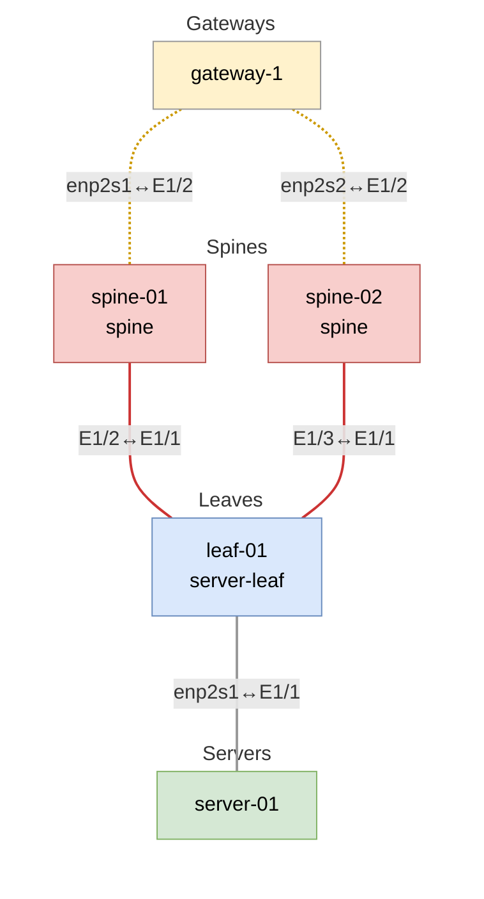

# Trivy Security Scanning System

## Overview

| File | Purpose |
|------|---------|
| `hack/vlab-trivy-runner.sh` | Main orchestration script |
| `hack/sarif-consolidator.sh` | SARIF processing and deduplication |
| `hack/trivy-setup.sh` | Online mode setup (control-1) |
| `hack/trivy-setup-airgapped.sh` | Airgapped mode setup (gateway-1) |
| `hack/trivy-setup-sonic-airgapped.sh` | SONiC switch setup |

The scripts perform comprehensive vulnerability scanning across a Hedgehog Fabric VLAB deployment using [Trivy](https://trivy.dev/). Rather than scanning isolated container images, we scan **running containers in a realistic network topology** to catch deployment-specific vulnerabilities and configuration issues.

The scripts generate security reports compatible with GitHub's Security tab, providing centralized vulnerability tracking and automated security alerts.

## Getting Started

### Recommended: GitHub Actions (CI)

The security scans are designed to run automatically in CI environments with full VLAB orchestration:

#### **Trigger via GitHub UI**:
1. Go to **Actions** tab in your repository
2. Select **"Security Scan"** workflow
3. Click **"Run workflow"** button
4. Choose scan scope:
   - `control-gateway` (default)
   - `control-only`
   - `gateway-only`
   - `switch-only`
   - `all`

#### **Trigger via PR Comment**:
```bash
# In any PR, comment:
/run security-scan
/run security-scan --all              # Full scan
/run security-scan --control-only     # Control VM only
```

#### **Automatic Triggers**:
- **Scheduled**: Nightly scans of main branch
- **PR Reviews**: Triggered on security-sensitive changes
- **Release**: Full scan before version releases

### Local Development Usage

For development and testing, you can run scans locally:

#### **Prerequisites**:
- Linux environment (tested on Fedora/Ubuntu)
- Docker installed and running
- `jq` command available (`sudo apt install jq` or `sudo dnf install jq`)
- Sufficient disk space (~10GB for full scan)
- Network access for downloading Trivy and vulnerability databases

#### **Basic Local Scan**:
```bash
# Scan core infrastructure (recommended for development)
./hack/vlab-trivy-runner.sh --control-only --gateway-only

# Scan everything (comprehensive security review)
./hack/vlab-trivy-runner.sh --all

# Use existing VLAB (if already running)
./hack/vlab-trivy-runner.sh --skip-vlab --control-only
```

#### **Local Scan Workflow**:
1. Script launches VLAB automatically
2. Installs Trivy on each VM with appropriate mode (online/airgapped)
3. Runs security scans across all enabled VMs
4. Collects and consolidates results
5. Generates GitHub-compatible SARIF reports
6. Cleans up VLAB environment

**Note**: Local scans take 15-30 minutes depending on scope and are primarily intended for development/debugging. Production security scanning should use the GitHub Actions workflow.

### Understanding the Output
```bash
# View consolidated results
ls sarif-reports/
cat sarif-reports/trivy-security-scan.sarif | jq '.runs[0].results | length'

# Check specific VM vulnerabilities
cat sarif-reports/trivy-consolidated-control-1.sarif | \
  jq '.runs[0].results[] | select(.level=="error") | .message.text'
```

### GitHub Integration
The system automatically:
1. **Uploads SARIF** to GitHub Security tab
2. **Sets environment variables** for downstream jobs
3. **Generates PR summaries** with vulnerability counts

## VLAB Architecture

Our security scans run against a minimal VLAB (Virtual Lab) topology that represents a real Hedgehog Fabric deployment:



### Node Types & Scanning Approaches

| Node Type | Role | Container Runtime | Scanning Approach | Network Access |
|-----------|------|------------------|-------------------|----------------|
| **control-1** | Control plane | K3s/containerd | Online | Internet access |
| **gateway-1** | Border gateway | K3s/containerd | Airgapped | Restricted |
| **spine/leaf switches** | SONiC switches | Docker | SONiC Airgapped | Isolated |

## Why VLAB Instead of Image Scanning?

### Traditional Approach Problems:
- **Scattered images** across registries (ghcr.io, docker.io, 172.30.0.1:31000)
- **Missing runtime context** - no deployment-specific configurations
- **Version drift** - images in registry vs. actually deployed

### VLAB Advantages:
- **Realistic deployment** - actual running containers with real configurations
- **Registry consistency** - scans exactly what's deployed
- **CI integration** - uses existing VLAB infrastructure

## Trivy Scanning Approaches

The system uses three scanning modes based on network access constraints:

**Online Mode (control-1)**: Direct internet access for real-time vulnerability DB updates
```bash
trivy image --format sarif --output report.sarif <image>
```

**Airgapped Mode (gateway-1, switches)**: Pre-cached vulnerability database, offline scanning with image export
```bash
# Gateway: Export K3s containers to tar files for offline scanning
ctr -a /run/k3s/containerd/containerd.sock -n k8s.io image export image.tar <image>
trivy image --offline-scan --input image.tar --format sarif

# Switches: Docker containers exported to tar
docker save <image> | trivy image --input /dev/stdin --format sarif
```

### Airgapped Mode Complexity

Airgapped environments cannot directly access container images from registries, requiring **image export and reconstruction**:

#### **Export Process**:
1. **Extract images** from containerd/Docker to tar files
2. **Transfer tar files** to scanning location
3. **Scan tar files** with pre-cached vulnerability database

#### **Reconstruction Challenge**:
SARIF files from airgapped scans contain **tar file paths** instead of original image names:
```bash
# Original image name (what we want):
docker.io/rancher/klipper-helm:v0.9.7

# SARIF imageName (what we get from airgapped scan):
/tmp/trivy-export-$/docker.io_rancher_klipper-helm_v0.9.7.tar
```

#### **Path Reconstruction Logic**:
The consolidator reconstructs original image names from tar paths:
```bash
# Tar basename: docker.io_rancher_klipper-helm_v0.9.7
# Registry patterns:
docker.io_path_to_image_v1.2.3     → docker.io/path/to/image:v1.2.3
172.30.0.1_31000_org_image_v1.2.3   → 172.30.0.1:31000/org/image:v1.2.3
```

This complexity is necessary because airgapped environments cannot access original registry metadata, requiring path-based reconstruction to map SARIF files back to deployed containers.

**Output formats**: SARIF (GitHub integration), JSON (programmatic), TXT (human-readable)

### SONiC Switch Load Balancing

SONiC switches scans are load balanced across available VMs to prevent SSH session timeouts during long scans. Images are distributed across available switches for parallel processing, reducing individual session times from 45+ minutes to ~15 minutes per switch.

## SARIF Adaptation for Container Security

### Traditional SARIF vs. Container SARIF

**Standard SARIF Usage** (source code analysis):
```json
{
  "artifactLocation": { "uri": "src/main.cpp" },
  "message": "Buffer overflow vulnerability",
  "ruleId": "CWE-119"
}
```

**Our Container SARIF Usage** (runtime vulnerability analysis):
```json
{
  "artifactLocation": { "uri": "control-1/zot:v2.1.1/libssl.so.3" },
  "message": "[control-1/zot:v2.1.1] Critical vulnerability in libssl",
  "properties": {
    "vmName": "control-1",
    "containerWithVersion": "zot:v2.1.1",
    "binaryName": "libssl.so.3",
    "scanContext": "runtime-deployment-online"
  }
}
```

### Artifact Path Structure

We transform container vulnerability locations into hierarchical SARIF artifact paths:

| SARIF Component | Container Mapping | Example |
|-----------------|-------------------|---------|
| **URI Root** | VM name | `control-1/` |
| **Directory** | Container with version | `zot:v2.1.1/` |
| **File** | Vulnerable binary/library | `libssl.so.3` |

**Complete artifact path**: `control-1/zot:v2.1.1/libssl.so.3`

### VM Context Preservation

Each vulnerability maintains deployment context through SARIF properties:

```json
{
  "properties": {
    "vmName": "control-1",
    "vmType": "control",
    "containerName": "zot",
    "containerVersion": "v2.1.1",
    "sourceImage": "172.30.0.1:31000/githedgehog/fabricator/zot:v2.1.1",
    "scanContext": "runtime-deployment-online",
    "artifactPath": "control-1/zot:v2.1.1"
  }
}
```

### Binary Context Extraction

The system extracts meaningful binary names from various URI formats:

| Original URI Format | Extracted Binary | Context |
|---------------------|------------------|---------|
| `/tmp/trivy-export-xyz.tar` | `{container-name}` | Airgapped tar scan |
| `usr/bin/kubectl` | `kubectl` | System binary |
| `/lib/x86_64-linux-gnu/libssl.so.3` | `libssl.so.3` | Shared library |
| `simple-binary` | `simple-binary` | Direct binary name |

### GitHub Security Integration Benefits

This SARIF adaptation enables:

1. **Hierarchical vulnerability browsing** - Navigate by VM → Container → Binary
2. **Deployment context tracking** - See which VM/environment has which vulnerabilities
3. **Centralized security dashboard** - All environments in one GitHub Security view
4. **Automated alerting** - GitHub notifications for new vulnerabilities
5. **Historical tracking** - Vulnerability trends across deployments

## Scan Outputs & Processing

### Output Formats
Each scan produces multiple output formats:
- **SARIF files** - For GitHub Security integration and automated processing
- **JSON files** - For programmatic analysis and custom tooling
- **TXT files** - Human-readable tabular reports for manual review

### Scan Results Structure
```
trivy-reports/
├── control-1/
│   ├── container_images.txt                    # List of scanned images
│   ├── fabric_v0.87.0_critical.sarif          # SARIF format (GitHub)
│   ├── fabric_v0.87.0_critical.json           # JSON format (programmatic)
│   ├── fabric_v0.87.0_critical.txt            # TXT format (human-readable)
│   └── ...
├── gateway-1/
│   ├── container_images.txt
│   ├── klipper-helm_critical.sarif
│   └── ...
└── sonic-switches/
    ├── container_images.txt
    ├── bgp_container_critical.sarif
    └── ...
```

### Deduplication Challenge
**Problem**: Same images deployed from different registries create duplicate vulnerabilities:
```bash
# Same container, different registries = duplicate reports
172.30.0.1:31000/githedgehog/fabricator/zot:v2.1.1  # 13 vulnerabilities
ghcr.io/githedgehog/fabricator/zot:v2.1.1           # 13 vulnerabilities (DUPLICATES!)
```

**Solution**: Use `imageID` (SHA256) for logical deduplication:
```bash
# Both have same imageID = same binary content = merge reports
imageID: sha256:b65f0e9f2e5dc7518c4bfae2649e681e7224915a756d014d8ca83cd1154c9df9
```

### Consolidation Process
```bash
hack/sarif-consolidator.sh
├── 1. Find SARIF files in trivy-reports/ subdirectories
├── 2. Map SARIF files to container images
├── 3. Deduplicate by imageID within each VM
├── 4. Merge vulnerabilities (unique by ruleId + location)
├── 5. Add VM context to vulnerability reports
└── 6. Generate final consolidated SARIF
```

## Image Mapping Logic

### The Challenge
SARIF files contain container references that must be mapped back to the deployed container images:
- **Online mode**: `imageName` contains direct registry paths (`docker.io/rancher/klipper-helm:v0.9.7`)
- **Airgapped mode**: `imageName` contains tar file paths (`/tmp/trivy-export-$/docker.io_rancher_klipper-helm_v0.9.7.tar`)

### Mapping Process

#### 1. Extract Image Metadata
```bash
# From each SARIF file, extract:
imageName=$(jq -r '.runs[0].properties.imageName' file.sarif)
imageID=$(jq -r '.runs[0].properties.imageID' file.sarif)  # SHA256 hash
```

#### 2. Handle Airgapped Reconstruction
For tar file paths, reconstruct the original image name:
```bash
# /tmp/trivy-export-$/docker.io_rancher_klipper-helm_v0.9.7.tar
# becomes: docker.io/rancher/klipper-helm:v0.9.7
```

#### 3. Validate Against Container List
Each VM has a `container_images.txt` file listing actually deployed images:
```bash
172.30.0.1:31000/githedgehog/fabric/fabric-boot:v0.84.3
docker.io/rancher/klipper-helm:v0.9.7-build20250616
...
```

#### 4. Deduplication by ImageID
Group SARIF files by `imageID` (SHA256) within each VM:
```bash
# Same imageID = same binary content = merge vulnerabilities
172.30.0.1:31000/githedgehog/fabricator/zot:v2.1.1  # imageID: sha256:b65f0e9f...
ghcr.io/githedgehog/fabricator/zot:v2.1.1           # imageID: sha256:b65f0e9f... (SAME)
# Result: Single vulnerability report using first image as representative
```

### Representative Image Selection

The **representative image** is the canonical image name chosen to represent a group of SARIF files that scan the same logical container:

**Deduplication Logic**:
1. **For images with same imageID**: The **first image encountered** becomes the representative
2. **For unique imageIDs**: Each image is its own representative

```bash
# Example deduplication process:
imageID_to_representative["sha256:b65f0e9f..."] = "172.30.0.1:31000/githedgehog/fabricator/zot:v2.1.1"

# All SARIF files with this imageID get mapped to the representative:
sarif_to_image_map["file1.sarif"] = "172.30.0.1:31000/githedgehog/fabricator/zot:v2.1.1"
sarif_to_image_map["file2.sarif"] = "172.30.0.1:31000/githedgehog/fabricator/zot:v2.1.1"
```

**Processing Result**: All SARIF files for the same `representative_image` get merged into a single vulnerability report, deduplicated by `ruleId + location`, and labeled with the representative image name in the final SARIF. This prevents duplicate vulnerabilities in GitHub Security while preserving source registry information.

#### 5. VM Context Preservation
Each vulnerability retains its deployment context:
```json
{
  "message": "[control-1/zot:v2.1.1] Critical vulnerability in libssl",
  "properties": {
    "vmName": "control-1",
    "containerWithVersion": "zot:v2.1.1",
    "sourceImage": "172.30.0.1:31000/githedgehog/fabricator/zot:v2.1.1"
  }
}
```

## Output Files & Artifacts

### Directory Structure
```
# Scan results with all formats
trivy-reports/
├── control-1/
│   ├── container_images.txt                    # List of scanned images
│   ├── fabric_v0.87.0_critical.sarif          # SARIF format (GitHub)
│   ├── fabric_v0.87.0_critical.json           # JSON format (programmatic)
│   ├── fabric_v0.87.0_critical.txt            # TXT format (human-readable)
│   └── ...
├── gateway-1/
│   ├── container_images.txt
│   └── ...
└── sonic-switches/
    ├── container_images.txt
    └── ...

# Consolidated reports (GitHub integration)
sarif-reports/
├── trivy-consolidated-control-1.sarif          # Per-VM consolidated
├── trivy-consolidated-gateway-1.sarif
├── trivy-consolidated-sonic-switches.sarif
└── trivy-security-scan.sarif                   # Final GitHub upload
```

### File Descriptions

**container_images.txt**: Authoritative list of deployed images per VM
```
172.30.0.1:31000/githedgehog/fabric/fabric-boot:v0.84.3
172.30.0.1:31000/githedgehog/fabric/fabric:v0.84.3
docker.io/rancher/klipper-helm:v0.9.7-build20250616
```

**Individual SARIF files**: Raw scan results per container
- Contains vulnerability details, imageID, imageName
- Used for mapping and deduplication logic

**Consolidated SARIF files**: Processed per-VM reports
- Deduplicated vulnerabilities within each VM
- VM context added to each vulnerability
- Clean artifact paths (vm-name/container:version/binary)

**Final SARIF report**: Single file for GitHub Security tab
- All VMs merged into one report
- Preserves VM context in vulnerability messages
- Enables centralized security dashboard

## Understanding the Security Scan Summary

### Summary Output Explained

The scan generates vulnerability metrics with clear descriptions:

```bash
=== Security Scan Summary ===
Total images scanned: 33
Unique Critical vulnerability rules: 3        # Different critical CVE types discovered
Unique High vulnerability rules: 18           # Different high CVE types discovered
Critical vulnerability instances: 5           # Total critical vulnerabilities found
High vulnerability instances: 38              # Total high vulnerabilities found
Total vulnerability instances: 43             # All vulnerability occurrences (5+38)

=== VM-Specific Breakdown ===
Control VM container images scanned: 25
  - Critical vulnerability instances: 4        # Critical vulnerabilities in control VM
  - High vulnerability instances: 32           # High vulnerabilities in control VM
```

### Understanding the Numbers

**Why different metrics matter:**
- **CVE Types**: How many different security issues exist (useful for security research)
- **Total Instances**: How many containers need patching (useful for operations)

**Example**:
```bash
CVE-2025-22868 found in 6 containers = 1 CVE type, 6 instances
CVE-2024-34156 found in 4 containers = 1 CVE type, 4 instances
Result: 2 unique CVE types, 10 total vulnerability instances
```

The **instances count** is typically what operations teams focus on for remediation planning.

### GitHub Security Integration

The consolidated SARIF enables:
- **Centralized vulnerability dashboard**
- **Automated security alerts**
- **Issue tracking** with affected files/containers
- **Historical trending** of vulnerability counts
- **Integration** with pull request checks

### VM Context Preservation
Each vulnerability report includes:
```json
{
  "ruleId": "CVE-2023-1234",
  "message": "[control-1/zot:v2.1.1] Critical vulnerability in libssl",
  "properties": {
    "vmName": "control-1",
    "vmType": "control",
    "containerName": "zot",
    "scanContext": "runtime-deployment-online"
  }
}
```

## Troubleshooting SARIF Consolidation

### Common Issues & Diagnostics

#### 1. GitHub Shows Different Vulnerability Count

**Problem**: Your summary shows different vulnerability counts than GitHub Security tab.

**Diagnosis**:
```bash
# Check if SARIF file is valid and matches your summary
jq empty sarif-reports/trivy-security-scan.sarif && echo "✓ Valid JSON" || echo "✗ Invalid JSON"
jq '.runs[0].results | length' sarif-reports/trivy-security-scan.sarif  # Should match your total

# Compare individual vs consolidated totals
echo "Individual: $(find trivy-reports -name "*_critical.sarif" -exec jq '.runs[0].results | length' {} + | paste -sd+ | bc)"
echo "Consolidated: $(jq '.runs[0].results | length' sarif-reports/trivy-security-scan.sarif)"

# Check SARIF upload timestamp in GitHub to ensure it's the latest
```

**Most Common Cause**:
- **GitHub processing delays** - The Security tab may show cached results from previous scans
- **Solution**: Wait for GitHub to process the latest SARIF upload, or create a fresh PR to reset the security scan state

#### 2. Deduplication Not Working

**Problem**: Same container appearing multiple times in vulnerability counts.

**Diagnosis**:
```bash
# Check if same containers have identical imageIDs (required for deduplication)
echo "=== Containers with same imageID (should be deduplicated) ==="
find trivy-reports -name "*_critical.sarif" -exec jq -r '(.runs[0].properties.imageName // "unknown") + " -> " + (.runs[0].properties.imageID // "no-id")' {} + | sort

# Look for containers with different imageIDs that should be the same
echo "=== Check specific container across registries ==="
find trivy-reports -name "*zot*_critical.sarif" -exec jq -r '(.runs[0].properties.imageName // "unknown") + " -> " + (.runs[0].properties.imageID // "no-id")' {} +

# Count duplicate vulnerability instances that should be deduplicated
jq -r '.runs[0].results[] | .ruleId + "@" + .locations[0].physicalLocation.artifactLocation.uri' sarif-reports/trivy-security-scan.sarif | sort | uniq -d
```

**Expected Behavior**:
- Same logical container from different registries → **Same imageID** → Deduplicated
- Different containers or versions → **Different imageIDs** → Not deduplicated

#### 3. Missing VM Context

**Problem**: Vulnerabilities not tagged with VM information.

**Diagnosis**:
```bash
# Check if all results have VM context
jq '.runs[0].results[] | select(.properties.vmName == null or .properties.vmName == "")' sarif-reports/trivy-security-scan.sarif

# Verify artifact paths include VM names
jq -r '.runs[0].results[].locations[0].physicalLocation.artifactLocation.uri' sarif-reports/trivy-security-scan.sarif | head -5

# Expected format: vm-name/container:version/binary
# Example: control-1/zot:v2.1.1/libssl.so.3
```

#### 4. Summary Calculation Verification

**Problem**: Summary numbers don't match expectations.

**Diagnosis**:
```bash
# Verify rule counts (unique CVE types)
echo "Critical rules: $(jq '[.runs[0].tool.driver.rules[]? | select(.properties.tags | contains(["CRITICAL"]))] | length' sarif-reports/trivy-security-scan.sarif)"
echo "High rules: $(jq '[.runs[0].tool.driver.rules[]? | select(.properties.tags | contains(["HIGH"]))] | length' sarif-reports/trivy-security-scan.sarif)"

# Verify instance counts (total vulnerabilities found)
echo "Critical instances: $(jq '[.runs[0].results[]? | select(.level == "error" and (.message.text | contains("CRITICAL")))] | length' sarif-reports/trivy-security-scan.sarif)"
echo "High instances: $(jq '[.runs[0].results[]? | select(.level == "error" and (.message.text | contains("HIGH")))] | length' sarif-reports/trivy-security-scan.sarif)"

# Check VM-specific counts
jq '[.runs[0].results[]? | select(.level == "error" and (.properties.vmName == "control-1"))] | length' sarif-reports/trivy-security-scan.sarif
jq '[.runs[0].results[]? | select(.level == "error" and (.properties.vmName == "gateway-1"))] | length' sarif-reports/trivy-security-scan.sarif
```

#### 5. Most Frequent CVEs Analysis

**Understanding**: Some CVEs appear in many containers, which is normal.

**Analysis**:
```bash
# Show most common vulnerabilities (helpful for prioritizing fixes)
jq -r '.runs[0].results[].ruleId' sarif-reports/trivy-security-scan.sarif | sort | uniq -c | sort -nr | head -10

# Show which containers have the most vulnerabilities
jq -r '.runs[0].results[] | .properties.containerWithVersion + " (" + .properties.vmName + ")"' sarif-reports/trivy-security-scan.sarif | sort | uniq -c | sort -nr | head -10
```

### Container Image Mapping Verification

The consolidator maps SARIF files to actual deployed containers:

```bash
# Verify image mapping worked correctly
echo "=== SARIF files successfully mapped to containers ==="
for vm in control-1 gateway-1; do
    echo "=== $vm ==="
    if [ -f "trivy-reports/$vm/container_images.txt" ]; then
        mapped=$(find trivy-reports/$vm -name "*_critical.sarif" -exec jq -r '.runs[0].properties.imageName // empty' {} + | grep -v "^$" | wc -l)
        total=$(find trivy-reports/$vm -name "*_critical.sarif" | wc -l)
        echo "Mapped: $mapped/$total SARIF files to container images"
    fi
done
```

### Debug Complete Consolidation Process

**Step-by-step verification**:
```bash
# 1. Check raw SARIF files exist
find trivy-reports -name "*_critical.sarif" | wc -l

# 2. Verify consolidation created output files
ls -la sarif-reports/

# 3. Check final SARIF structure
jq '.runs[0] | keys' sarif-reports/trivy-security-scan.sarif

# 4. Verify comprehensive summary
echo "=== Complete SARIF Summary ==="
echo "Images scanned: $(for vm in trivy-reports/*/; do [ -f "$vm/container_images.txt" ] && wc -l < "$vm/container_images.txt"; done | paste -sd+ | bc)"
echo "Total results: $(jq '.runs[0].results | length' sarif-reports/trivy-security-scan.sarif)"
echo "Unique rules: $(jq '.runs[0].tool.driver.rules | length' sarif-reports/trivy-security-scan.sarif)"
echo "Critical: $(jq '[.runs[0].results[]? | select(.level == "error" and (.message.text | contains("CRITICAL")))] | length' sarif-reports/trivy-security-scan.sarif)"
echo "High: $(jq '[.runs[0].results[]? | select(.level == "error" and (.message.text | contains("HIGH")))] | length' sarif-reports/trivy-security-scan.sarif)"
```

## Workflow Options

### Manual Dispatch Options
```yaml
# .github/workflows/security-scan.yml
workflow_dispatch:
  inputs:
    scan_scope:
      description: 'Select components to scan'
      required: true
      default: 'control-gateway'
      type: choice
      options:
        - 'control-gateway'
        - 'control-only'
        - 'gateway-only'
        - 'switch-only'
        - 'all'
```

## Getting Started

### Run a Basic Scan
```bash
# Scan core infrastructure (recommended for development)
./hack/vlab-trivy-runner.sh --control-only --gateway-only

# Scan everything (CI/comprehensive security review
./hack/vlab-trivy-runner.sh --all

# Use existing VLAB (if already running)
./hack/vlab-trivy-runner.sh --skip-vlab --control-only
```

### Understanding the Output
```bash
# View consolidated results
ls sarif-reports/
cat sarif-reports/trivy-security-scan.sarif | jq '.runs[0].results | length'

# Check specific VM vulnerabilities
cat sarif-reports/trivy-consolidated-control-1.sarif | \
  jq '.runs[0].results[] | select(.level=="error") | .message.text'
```

### GitHub Integration
The system automatically:
1. **Uploads SARIF** to GitHub Security tab
2. **Sets environment variables** for downstream jobs
3. **Generates PR summaries** with vulnerability counts
