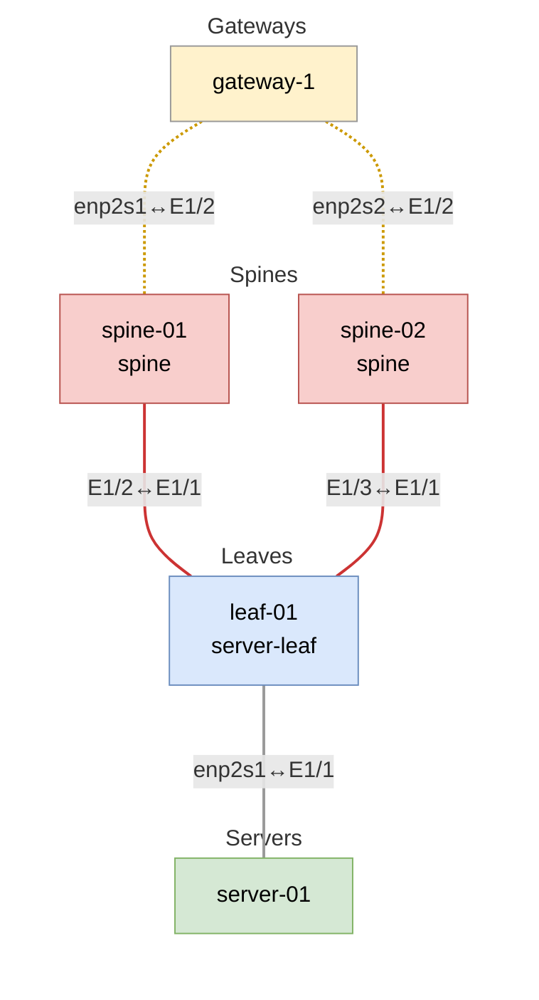

# Trivy Security Scanning System

## Overview

| File | Purpose |
|------|---------|
| `hack/vlab-trivy-runner.sh` | Main orchestration script |
| `hack/sarif-consolidator.sh` | SARIF processing and deduplication |
| `hack/trivy-setup.sh` | Online mode setup (control-1) |
| `hack/trivy-setup-airgapped.sh` | Airgapped mode setup (gateway-1) |
| `hack/trivy-setup-sonic-airgapped.sh` | SONiC switch setup |

The scripts perform comprehensive vulnerability scanning across a Hedgehog Fabric VLAB deployment using [Trivy](https://trivy.dev/). Rather than scanning isolated container images, we scan **running containers in a realistic network topology** to catch deployment-specific vulnerabilities and configuration issues.

The scripts generate security reports compatible with GitHub's Security tab, providing centralized vulnerability tracking and automated security alerts.

## VLAB Architecture

Our security scans run against a minimal VLAB (Virtual Lab) topology that represents a real Hedgehog Fabric deployment:



### Node Types & Scanning Approaches

| Node Type | Role | Container Runtime | Scanning Approach | Network Access |
|-----------|------|------------------|-------------------|----------------|
| **control-1** | Control plane | K3s/containerd | Online | Internet access |
| **gateway-1** | Border gateway | K3s/containerd | Airgapped | Restricted |
| **spine/leaf switches** | SONiC switches | Docker | SONiC Airgapped | Isolated |

## Why VLAB Instead of Image Scanning?

### Traditional Approach Problems:
- **Scattered images** across registries (ghcr.io, docker.io, 172.30.0.1:31000)
- **Missing runtime context** - no deployment-specific configurations
- **Version drift** - images in registry vs. actually deployed

### VLAB Advantages:
- **Realistic deployment** - actual running containers with real configurations
- **Registry consistency** - scans exactly what's deployed
- **CI integration** - uses existing VLAB infrastructure

## Trivy Scanning Approaches

The system uses three scanning modes based on network access constraints:

**Online Mode (control-1)**: Direct internet access for real-time vulnerability DB updates
```bash
trivy image --format sarif --output report.sarif <image>
```

**Airgapped Mode (gateway-1, switches)**: Pre-cached vulnerability database, offline scanning
```bash
# Gateway: K3s containers
trivy image --offline-scan --format sarif <image>

# Switches: Docker containers exported to tar
docker save <image> | trivy image --input /dev/stdin --format sarif
```

**Output formats**: SARIF (GitHub integration), JSON (programmatic), TXT (human-readable)

### SONiC Switch Load Balancing

SONiC switches scans are load balanced across available VMs to prevent SSH session timeouts during long scans. Images are distributed across available switches for parallel processing, reducing individual session times from 45+ minutes to ~15 minutes per switch.

## SARIF Enrichment for Infrastructure Context

### Traditional SARIF vs Infrastructure SARIF

Standard vulnerability scanners generate SARIF files with basic artifact paths:
```json
{
  "artifactLocation": {
    "uri": "usr/bin/bash"
  },
  "message": "CVE-2023-1234: Critical vulnerability in bash"
}
```

Our system transforms these into infrastructure-aware SARIF files with full deployment context:
```json
{
  "artifactLocation": {
    "uri": "control-1/fabric:v0.87.0/bash"
  },
  "message": "[control-1/fabric:v0.87.0] CVE-2023-1234: Critical vulnerability in bash",
  "properties": {
    "vmName": "control-1",
    "vmType": "control",
    "containerName": "fabric",
    "containerVersion": "v0.87.0",
    "sourceImage": "172.30.0.1:31000/githedgehog/fabric/fabric:v0.87.0",
    "scanContext": "runtime-deployment-online",
    "binaryName": "bash"
  }
}
```

### SARIF Artifact Path Structure

Each vulnerability is mapped to a structured path that identifies its deployment location:
```
{vm-name}/{container:version}/{binary}

Examples:
- control-1/fabric:v0.87.0/kubectl      # kubectl binary in fabric container on control VM
- gateway-1/klipper-helm:v0.9.7/helm   # helm binary in klipper container on gateway VM
- sonic-switches/bgp:latest/zebra       # zebra daemon in BGP container on SONiC switches
```

This enables GitHub Security tab filtering by:
- **Infrastructure tier**: `control-1/*`, `gateway-1/*`, `sonic-switches/*`
- **Application component**: `*/fabric:*/*`, `*/klipper-helm:*/*`
- **Binary/service**: `*/*/kubectl`, `*/*/helm`, `*/*/zebra`

### VM-to-Image Mapping Process

The consolidator maps Trivy's raw SARIF outputs to our infrastructure model:

#### 1. Extract Container Metadata
```bash
# From VM's container_images.txt
172.30.0.1:31000/githedgehog/fabric/fabric:v0.87.0
docker.io/rancher/klipper-helm:v0.9.7

# From SARIF properties
imageName: "172.30.0.1:31000/githedgehog/fabric/fabric:v0.87.0"
imageID: "sha256:abc123..."  # For deduplication
```

#### 2. Handle Airgapped Reconstruction
```bash
# Raw airgapped imageName (tar file path):
"/tmp/trivy-export-$/docker.io_rancher_klipper-helm_v0.9.7.tar"

# Reconstructed to original image name:
"docker.io/rancher/klipper-helm:v0.9.7"
```

#### 3. Deduplication by Image ID
```bash
# Same imageID = same binary content = single vulnerability report
172.30.0.1:31000/githedgehog/fabricator/zot:v2.1.1  # imageID: sha256:b65f0e9f...
ghcr.io/githedgehog/fabricator/zot:v2.1.1           # imageID: sha256:b65f0e9f... (SAME)
# Result: Merge vulnerabilities, use first image as representative
```

#### 4. Binary Path Extraction
```bash
# Original artifact URI from Trivy
"usr/bin/kubectl"           → kubectl
"/tmp/trivy-export-*.tar"   → {container-name}
"lib/x86_64-linux-gnu/..."  → {library-name}
```

## Scan Outputs & Processing

### Output Formats
Each scan produces multiple output formats:
- **SARIF files** - For GitHub Security integration and automated processing
- **JSON files** - For programmatic analysis and custom tooling
- **TXT files** - Human-readable tabular reports for manual review

### Scan Results Structure
```
trivy-reports/
├── control-1/
│   ├── container_images.txt                    # List of scanned images
│   ├── fabric_v0.87.0_critical.sarif          # SARIF format (GitHub)
│   ├── fabric_v0.87.0_critical.json           # JSON format (programmatic)
│   ├── fabric_v0.87.0_critical.txt            # TXT format (human-readable)
│   └── ...
└── gateway-1/
    ├── container_images.txt
    └── ...
```

### Raw SARIF Files
The SARIF consolidator processes files from:
```
raw-sarif-reports/
├── control-1/
│   ├── 20250729-120000_fabric_v0.87.0_critical.sarif
│   ├── 20250729-120000_zot_v2.1.1_critical.sarif
│   └── ...
├── gateway-1/
│   ├── 20250729-120100_klipper-helm_critical.sarif
│   └── ...
└── sonic-switches/
    ├── 20250729-120200_bgp_container_critical.sarif
    └── ...
```

### Deduplication Challenge
**Problem**: Same images deployed from different registries create duplicate vulnerabilities:
```bash
# Same container, different registries = duplicate reports
172.30.0.1:31000/githedgehog/fabricator/zot:v2.1.1  # 13 vulnerabilities
ghcr.io/githedgehog/fabricator/zot:v2.1.1           # 13 vulnerabilities (DUPLICATES!)
```

**Solution**: Use `imageID` (SHA256) for logical deduplication:
```bash
# Both have same imageID = same binary content = merge reports
imageID: sha256:b65f0e9f2e5dc7518c4bfae2649e681e7224915a756d014d8ca83cd1154c9df9
```

### Consolidation Process
```bash
hack/sarif-consolidator.sh
├── 1. Group SARIF files by VM
├── 2. Map SARIF files to container images
├── 3. Deduplicate by imageID within each VM
├── 4. Merge vulnerabilities (unique by ruleId + location)
├── 5. Add VM context to vulnerability reports
└── 6. Generate individual VM SARIF files
```

## GitHub Security Integration

### Multiple SARIF Categories

The system uploads separate SARIF files for each infrastructure tier:
```yaml
# GitHub Security tab categories
- trivy-control  # Control plane vulnerabilities
- trivy-gateway  # Gateway vulnerabilities
- trivy-sonic    # SONiC switch vulnerabilities
```

This enables filtering by infrastructure component in GitHub's Security tab, making it easier to:
- **Prioritize** control plane vs edge vulnerabilities
- **Assign** teams based on component ownership
- **Track** remediation progress by infrastructure tier

### VM Context Preservation
Each vulnerability report includes full deployment context:
```json
{
  "ruleId": "CVE-2023-1234",
  "message": "[control-1/fabric:v0.87.0] Critical vulnerability in kubectl",
  "locations": [{
    "physicalLocation": {
      "artifactLocation": {
        "uri": "control-1/fabric:v0.87.0/kubectl"
      }
    }
  }],
  "properties": {
    "vmName": "control-1",
    "vmType": "control",
    "containerName": "fabric",
    "containerVersion": "v0.87.0",
    "sourceImage": "172.30.0.1:31000/githedgehog/fabric/fabric:v0.87.0",
    "scanContext": "runtime-deployment-online",
    "binaryName": "kubectl"
  }
}
```

## Output Files & Artifacts

### Directory Structure
```
# Raw scan results per VM
trivy-reports/
├── control-1/
│   ├── container_images.txt                    # List of scanned images
│   ├── fabric_v0.87.0_critical.sarif          # SARIF format (GitHub)
│   ├── fabric_v0.87.0_critical.json           # JSON format (programmatic)
│   ├── fabric_v0.87.0_critical.txt            # TXT format (human-readable)
│   └── ...
├── gateway-1/
│   ├── container_images.txt
│   └── ...
└── sonic-switches/
    ├── container_images.txt
    └── ...

# Raw SARIF files (input to consolidator)
raw-sarif-reports/
├── control-1/
│   ├── 20250729-120000_fabric_v0.87.0_critical.sarif
│   ├── 20250729-120000_zot_v2.1.1_critical.sarif
│   └── ...
├── gateway-1/
│   └── ...
└── sonic-switches/
    └── ...

# Consolidated reports (GitHub integration)
sarif-reports/
├── trivy-consolidated-control-1.sarif          # Control VM vulnerabilities
├── trivy-consolidated-gateway-1.sarif          # Gateway VM vulnerabilities
└── trivy-consolidated-sonic-switches.sarif     # SONiC switch vulnerabilities
```

### File Descriptions

**container_images.txt**: Authoritative list of deployed images per VM
```
172.30.0.1:31000/githedgehog/fabric/fabric-boot:v0.84.3
172.30.0.1:31000/githedgehog/fabric/fabric:v0.84.3
docker.io/rancher/klipper-helm:v0.9.7-build20250616
```

**Individual SARIF files**: Raw scan results per container
- Contains vulnerability details, imageID, imageName
- Used for mapping and deduplication logic

**Consolidated SARIF files**: Processed per-VM reports
- Deduplicated vulnerabilities within each VM
- VM context added to each vulnerability
- Clean artifact paths (vm-name/container:version/binary)
- Uploaded to GitHub Security tab with unique categories

## Workflow Options

### Manual Dispatch Options
```yaml
# .github/workflows/security-scan.yml
workflow_dispatch:
  inputs:
    vm_selection:
      description: 'Select components to scan'
      required: true
      default: 'control-gateway'
      type: choice
      options:
        - 'control-gateway'
        - 'control-only'
        - 'gateway-only'
        - 'switch-only'
        - 'all'
```

## Getting Started

### Run a Basic Scan
```bash
# Scan core infrastructure (recommended for development)
./hack/vlab-trivy-runner.sh --control-only --gateway-only

# Scan everything (CI/comprehensive security review
./hack/vlab-trivy-runner.sh --all

# Use existing VLAB (if already running)
./hack/vlab-trivy-runner.sh --skip-vlab --control-only
```

### Understanding the Output
```bash
# View consolidated results by VM
ls sarif-reports/
jq '.runs[0].results | length' sarif-reports/trivy-consolidated-control-1.sarif

# Check specific VM vulnerabilities with infrastructure context
jq '.runs[0].results[] | select(.level=="error") | .message.text' \
  sarif-reports/trivy-consolidated-control-1.sarif

# Find vulnerabilities in specific container
jq '.runs[0].results[] | select(.properties.containerName=="fabric") | .message.text' \
  sarif-reports/trivy-consolidated-control-1.sarif
```

### GitHub Integration
The system automatically:
1. **Uploads multiple SARIF files** to GitHub Security tab with unique categories
2. **Sets environment variables** for downstream jobs
3. **Generates PR summaries** with vulnerability counts per VM
4. **Preserves infrastructure context** in vulnerability artifact paths
